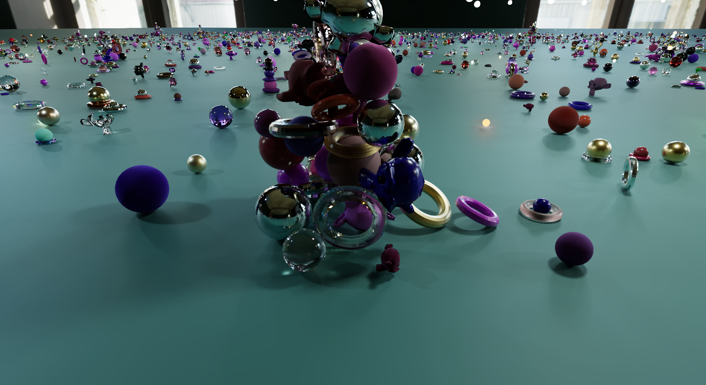
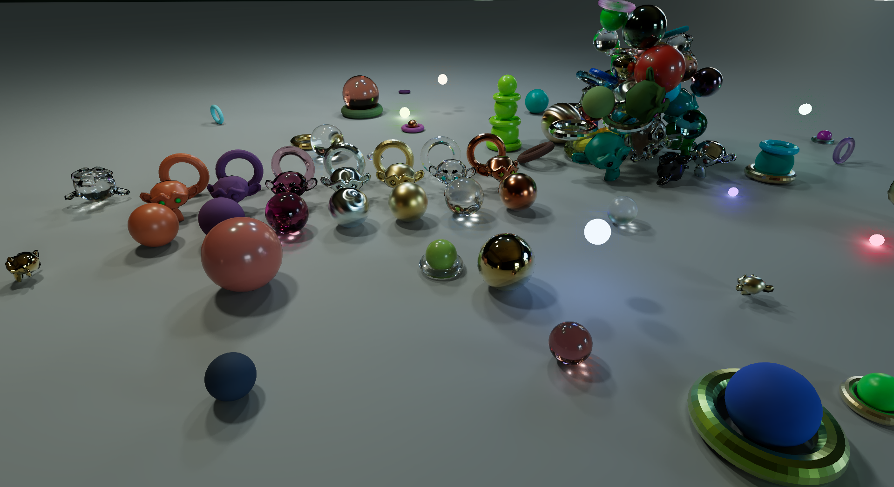
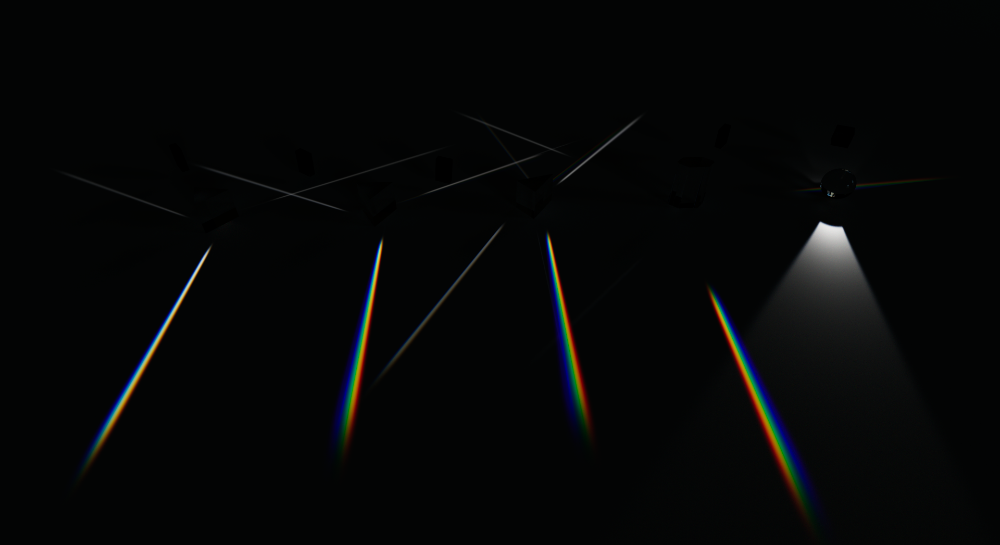
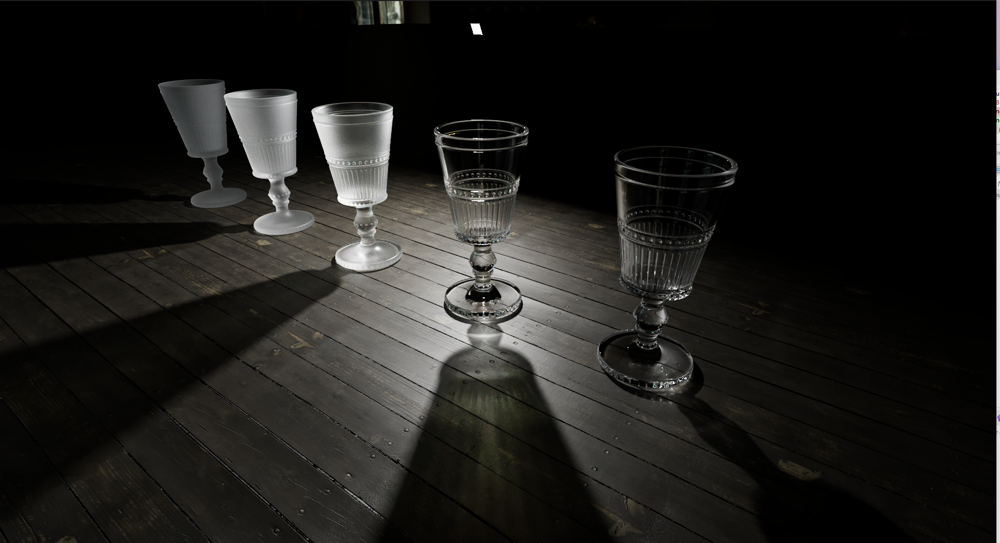
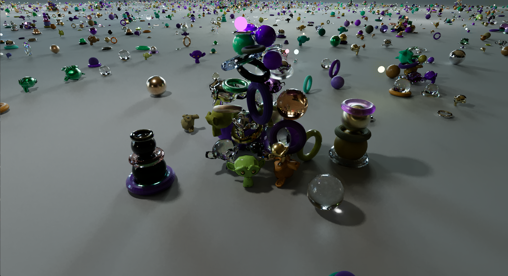
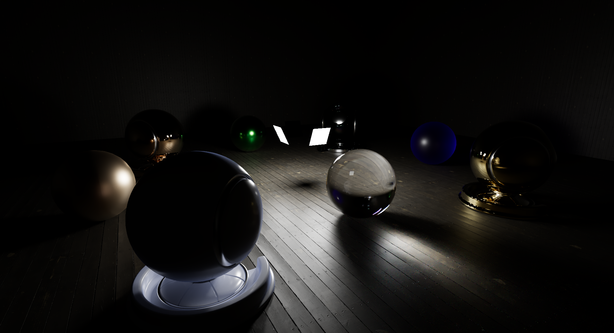

# YAPT — Yet Another Path Tracer

YAPT is a hobby project: a GPU path tracer written by a real-time rendering engineer who wanted to understand offline rendering better. It's a place to learn by implementing, not a production renderer.



## What it is

- **GPU path tracer** written in C++17 with HLSL shaders, using hardware ray tracing.
- **DirectX 12 and Vulkan backends** behind a common, handle-based graphics abstraction layer. The backend is chosen at configure time.
- **Spectral rendering**: light transport is computed per wavelength rather than in RGB, which gives effects like dispersion for free.
- **Three integrators**:
  - a simple unidirectional camera path tracer
  - a unidirectional camera path tracer with next event estimation (NEE)
  - a bidirectional path tracer (BDPT)
- **"Principled" material model**: material components are blended and layered together so that the combination conserves and preserves energy, instead of each lobe being treated in isolation.
- **Python/Qt front-end**: the C++ core is driven and inspected from a PySide6 application through pybind11 bindings.

Some decisions are experiments to see how the offline approach compares with what real-time renderers usually do. Examples are rendering spectrally instead of with tristimulus RGB, and using full Fresnel equations instead of Schlick's approximation.

## What it isn't

This is a hobby project, so features get added when I decide I need them, and many aspects are neglected entirely:

- **Tests**: there is effectively no test coverage. There's an integrator comparison harness, but nothing like a real test suite.
- **Scene and editor**: scene handling is minimal and there is no real editor. Scenes are mostly built from Python scripts.
- **Architecture**: many design decisions were made because they were the fastest to implement, not because they are how things should be done. A lot of it needs a proper rewrite later. For example, the frame graph should be much less static than it is now.

Expect rough edges everywhere outside whatever I'm currently interested in.

## Gallery

| | |
|---|---|
|  |  |
|  |  |
|  |  |

## Future plans

- Subsurface scattering
- Possibly participating media / volumes
- Possibly a real-time renderer using hybrid rasterization and path tracing

## Building

Windows and MSVC only.

```
cmake -S . -B Build -G "Visual Studio 17 2022"
cmake --build Build --config Debug
```

- vcpkg is bootstrapped automatically if it isn't already on `PATH`, so the first configure can take a while.
- DirectX 12 is the default backend. To use Vulkan, configure with `-DGRAPHICS_API=Vulkan`.
- Python 3 with pip is required. Configure installs `pybind11`, `pyside6`, `pygltflib` and `pyktx` into that environment.
- Binaries end up in `Build/Bin/<Config>/`.

## Running

The `YAPT` executable starts an embedded Python interpreter and runs `Source/Python/pythonScripts/default_bootstrap.py`, which opens the Qt application. Example scenes are in `Source/Python/pythonScripts/examples/`.

Models and textures aren't stored in the repository. They are loaded from an asset folder set by `asset_path` in `settings.cfg`, which defaults to `../YAPTAssets` next to the repo. To override it for one machine, create a `settings_local.cfg` with the same layout.

## AI usage

This README was written by AI. Most of the Python scripts, including the Qt front-end, were generated by AI as well. The rendering code is mostly written by hand, partly because the project is several years old. AI has been used to hunt for bugs in it, and will probably be used more in the future.

The example assets were either generated by AI or taken from free asset sources such as [Poly Haven](https://polyhaven.com) and [BlenderKit](https://www.blenderkit.com).

## License

MIT. See [LICENSE](LICENSE).
